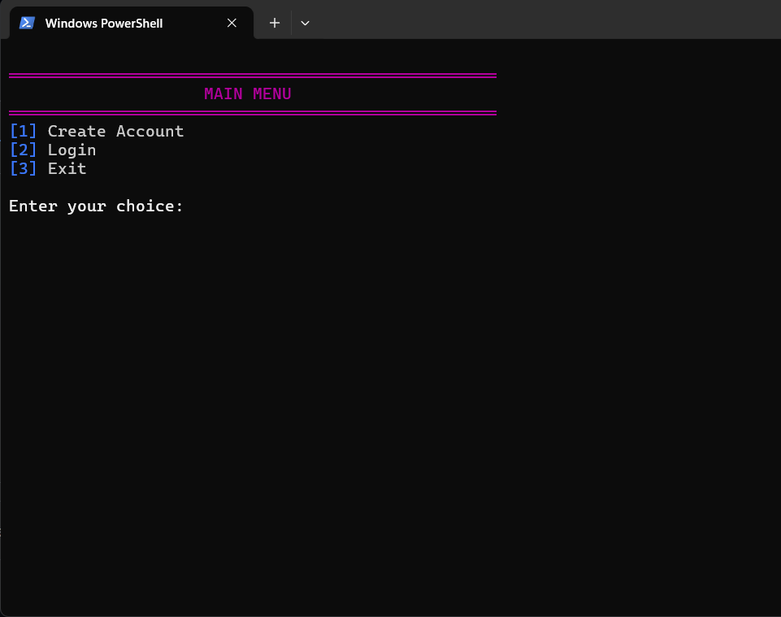

# 🏦 SecureBank - Terminal-Based Banking System

A fully-featured CLI Banking System in Python that allows users to securely create accounts, deposit/withdraw funds, and view transaction history — all with stylish console UI and persistent file storage.

---

## 🚀 Features

- Create account with hashed password (SHA-256)
- Secure login system
- Deposit and withdraw with validations
- Transaction history with timestamps
- File-based data storage (`accounts.txt`, `transactions.txt`)
- Stylish terminal UI with ANSI color codes
- ASCII headers and loading animations
- Receipt-style withdrawal slips

---

## 📸 Screenshots

| Welcome Screen | Transaction History |
|----------------|---------------------|
|  |  |

---

## 🛠️ Technologies Used

- **Python 3**
- Built-in modules: `hashlib`, `getpass`, `datetime`, `os`, `random`, `time`, `sys`
- File handling (CSV-style using `.txt`)
- Terminal styling using ANSI escape codes

---

## 📂 Project Structure

